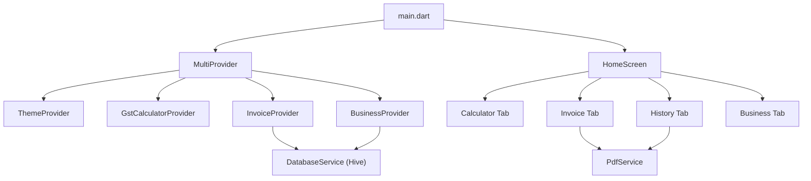
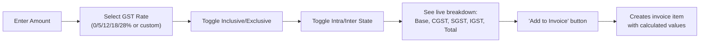
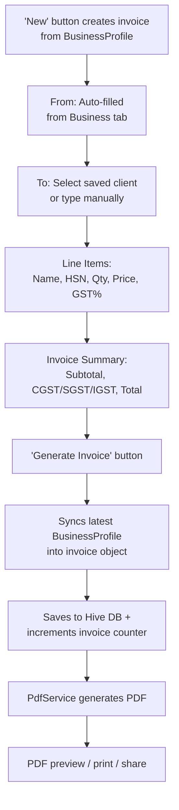
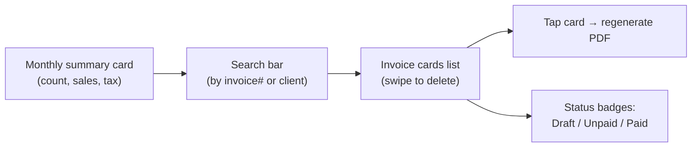
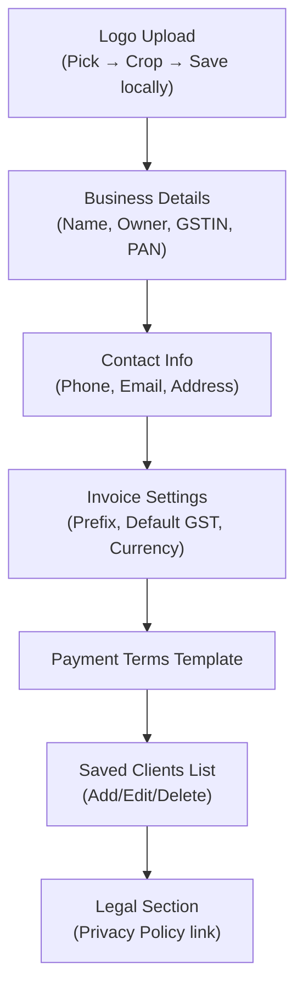
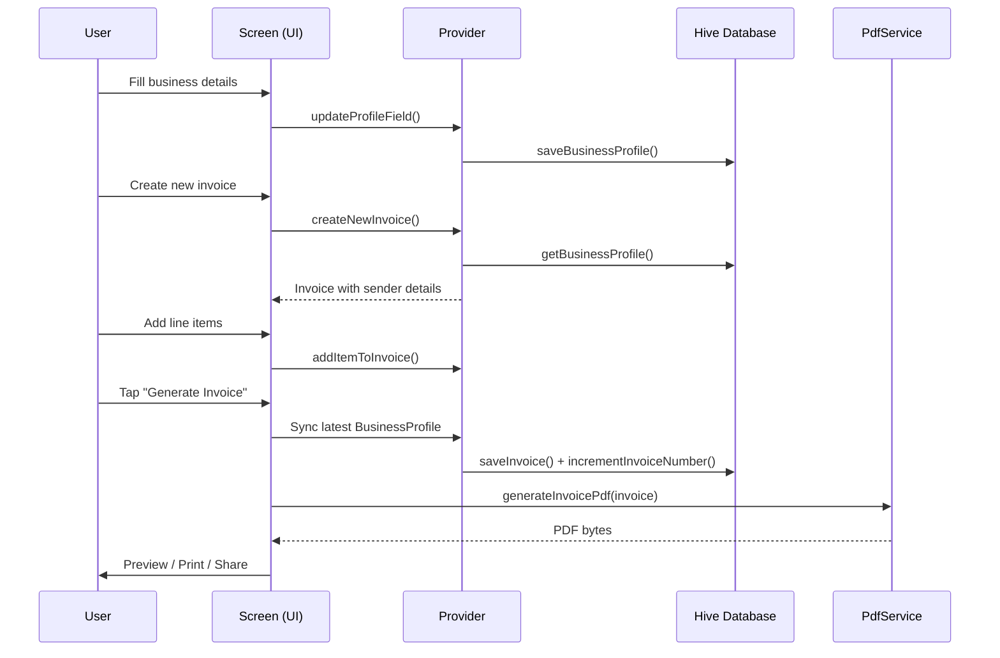

# GSTBubble — Invoice & Calculator by Bubblesort

> **Complete Application Documentation**
> Version 1.0.0 · Flutter · Dart · Android/iOS/Web

---

## 1. App Overview

GSTBubble is a **GST Calculator & Invoice Generator** built for Indian small businesses. It runs entirely **offline** — all data stays on the user's device. No server, no cloud, no tracking.

### What It Does
| Feature | Description |
|---|---|
| **GST Calculator** | Instant tax breakdown (CGST/SGST/IGST) for any amount |
| **Invoice Generator** | Create professional PDF invoices with line items |
| **Invoice History** | Browse, search, re-download past invoices |
| **Business Profile** | Save your business details & logo for reuse |

---

## 2. Architecture



### Design Pattern: **Provider + Service Layer**

| Layer | Role | Files |
|---|---|---|
| **Screens** | UI widgets, user interaction | `lib/screens/` |
| **Providers** | State management via `ChangeNotifier` | `lib/core/providers/` |
| **Services** | Database I/O, PDF generation | `lib/core/services/` |
| **Models** | Data classes (Invoice, Client, GstResult) | `lib/core/models/` |
| **Utils** | Currency formatting, legal dialog | `lib/core/utils/` |
| **Theme** | Light/Dark color system, typography | `lib/core/theme/` |
| **Data** | Static HSN code list | `lib/core/data/` |

---

## 3. Project File Map

```
lib/
├── main.dart                          # App entry point, provider setup
├── core/
│   ├── data/
│   │   └── hsn_codes.dart             # 80+ common HSN codes
│   ├── models/
│   │   ├── client.dart                # Client + BusinessProfile models
│   │   ├── gst_result.dart            # GST calculation result model
│   │   └── invoice.dart               # Invoice + InvoiceItem models
│   ├── providers/
│   │   ├── business_provider.dart     # Business profile & client state
│   │   ├── gst_calculator_provider.dart # Calculator state
│   │   ├── invoice_provider.dart      # Invoice CRUD state
│   │   └── theme_provider.dart        # Light/Dark toggle
│   ├── services/
│   │   ├── database_service.dart      # Hive DB operations
│   │   └── pdf_service.dart           # PDF generation engine
│   ├── theme/
│   │   └── app_theme.dart             # AppColors, AppTheme (Light+Dark)
│   └── utils/
│       ├── currency_utils.dart        # Indian currency formatting + number-to-words
│       └── legal_dialog.dart          # Privacy Policy & T&C popup
└── screens/
    ├── home_screen.dart               # Bottom nav bar + tab switching
    ├── gst_calculator/
    │   └── gst_calculator_screen.dart # Calculator UI (~757 lines)
    ├── invoice/
    │   └── create_invoice_screen.dart # Invoice creation UI (~406 lines)
    ├── history/
    │   └── invoice_history_screen.dart # Invoice history + search (~220 lines)
    └── profile/
        └── business_profile_screen.dart # Business setup UI (~300+ lines)
```

---

## 4. Packages & Dependencies

| Package | Version | Purpose |
|---|---|---|
| `provider` | ^6.1.2 | State management across the app |
| `hive` | ^2.2.3 | Local NoSQL database (key-value) |
| `hive_flutter` | ^1.1.0 | Hive initialization for Flutter |
| `pdf` | ^3.11.2 | Programmatic PDF document building |
| `printing` | ^5.13.4 | PDF preview, share, print |
| `image_picker` | ^1.1.2 | Pick images from gallery/camera |
| `image_cropper` | ^12.2.1 | Crop, zoom, rotate images (UCrop) |
| `path_provider` | ^2.1.5 | Get app documents directory |
| `google_fonts` | ^6.2.1 | Inter & Poppins font families |
| `intl` | ^0.20.2 | Date formatting |
| `uuid` | ^4.5.1 | Unique ID generation for invoices/items |
| `flutter_launcher_icons` | ^0.14.3 | Custom app icon generation (dev) |

---

## 5. App Workflow (Tab by Tab)

### Tab 1: GST Calculator



**How it works internally:**
1. User types amount → `GstCalculatorProvider.setAmount()` triggers `_calculate()`
2. `GstResult.calculate()` factory does the math:
   - **Exclusive**: `baseAmount = amount`, `gst = amount × rate / 100`
   - **Inclusive**: `baseAmount = amount / (1 + rate/100)`, `gst = amount - base`
   - **Intra-state**: Splits GST into `CGST = gst/2` and `SGST = gst/2`
   - **Inter-state**: Full amount goes to `IGST`
3. Provider calls `notifyListeners()` → UI rebuilds with new result
4. "Add to Invoice" calls `InvoiceProvider.addItemFromCalculator()` which auto-creates an invoice from BusinessProfile if none exists

### Tab 2: Create Invoice



**Key behaviors:**
- **Sender card** reads live from `BusinessProvider.profile` via `context.watch`
- **Line items** support: custom Qty (including 0), custom Price, floating-point GST (e.g. 1.5%)
- **HSN helper** dialog lets you search 80+ common HSN codes
- **Inter-state toggle** per item controls CGST+SGST vs IGST split
- Before PDF generation, `_generateInvoice()` force-syncs all BusinessProfile fields into the invoice

### Tab 3: Invoice History



**How it works:**
- `InvoiceProvider.loadInvoices()` reads all invoices from Hive, sorted by date descending
- `getMonthlySummary()` aggregates current month's totals
- `searchInvoices()` filters by invoice number or client name
- Re-downloading regenerates PDF from saved data via `PdfService`

### Tab 4: Business Profile



**Logo workflow:**
1. `ImagePicker` opens gallery (max 1024×1024)
2. `ImageCropper` (UCrop) opens with crop/zoom/rotate — supports Square, 3:2, 4:3, 16:9, free
3. Cropped image is copied to `getApplicationDocumentsDirectory()` for permanent storage
4. Path saved to `BusinessProfile.logoPath` via Hive

**Data persistence:**
- Every field change calls `BusinessProvider.updateProfileField()` → instantly saves to Hive
- Data survives app restarts, cache clears, and updates

---

## 6. Data Models

### `InvoiceItem`
| Field | Type | Default | Description |
|---|---|---|---|
| `id` | String | UUID | Unique identifier |
| `itemName` | String | `''` | Product/service name |
| `hsnCode` | String | `''` | HSN/SAC code |
| `quantity` | double | `1` | Quantity (supports decimals) |
| `unitPrice` | double | `0` | Price per unit |
| `gstRate` | double | `18` | GST percentage (supports 1.5%, etc.) |
| `isInterState` | bool | `false` | IGST if true, else CGST+SGST |

**Computed properties:** `amount`, `gstAmount`, `cgst`, `sgst`, `igst`, `totalAmount`

### `Invoice`
| Field | Type | Description |
|---|---|---|
| `id` | String (UUID) | Unique invoice ID |
| `invoiceNumber` | String | Formatted: `PREFIX-0001` |
| `invoiceDate` / `dueDate` | DateTime | Dates |
| `senderName/Gstin/Address/Phone/Email` | String | From business profile |
| `clientName/Gstin/Address` | String | Bill-to details |
| `items` | List\<InvoiceItem\> | Line items |
| `status` | InvoiceStatus | draft / unpaid / paid |
| `paymentTerms` / `notes` | String | Footer text |
| `logoPath` | String? | Path to business logo |

**Computed:** `subtotal`, `totalCgst`, `totalSgst`, `totalIgst`, `totalGst`, `grandTotal`, `gstBreakdown`

### `BusinessProfile`
Stores: businessName, ownerName, gstin, pan, phone, email, address, logoPath, invoicePrefix, nextInvoiceNumber, defaultGstRate, currency, paymentTerms

### `Client`
Stores: id, name, gstin, address, phone, email

---

## 7. Database (Hive)

Hive is a lightweight, pure-Dart NoSQL database. Data is stored in **Boxes** (like tables).

| Box Name | Key | Value | Purpose |
|---|---|---|---|
| `settings` | `'businessProfile'` | Map | Business profile data |
| `invoices` | Invoice UUID | Map | Invoice header data |
| `invoice_items` | Invoice UUID | List\<Map\> | Line items per invoice |
| `clients` | Client UUID | Map | Saved client records |

**Invoice numbering:** The `nextInvoiceNumber` field lives inside `BusinessProfile`. When an invoice is saved for the first time, `DatabaseService.incrementInvoiceNumber()` bumps the counter by 1 and persists it back to the profile.

---

## 8. PDF Generation

[pdf_service.dart](file:///c:/Users/ANKAN/Desktop/Coding/Flutter/GST%20Invoice/lib/core/services/pdf_service.dart) generates a professional A4 invoice PDF.

### PDF Layout Structure
```
┌──────────────────────────────────────────┐
│  [Logo] Business Name        TAX INVOICE │  ← Dark header
│         GSTIN, Address       INV-0001    │
├────────────────────┬─────────────────────┤
│  Invoice Details   │  Bill To            │  ← Light grey boxes
│  No, Date, Due     │  Client, GSTIN, Addr│
├────────────────────┴─────────────────────┤
│  # │ Item │ HSN │ Qty │ Price │GST%│ ... │  ← Items table
│  1 │ ...  │ ... │ ... │  ...  │C+S │ ... │
│  2 │ ...  │ ... │ ... │  ...  │IGST│ ... │
├──────────────────────────────────────────┤
│  Amount in Words    │  Subtotal          │  ← Totals
│  Rupees ... Only    │  CGST @ 9%  Rs.xxx │
│                     │  SGST @ 9%  Rs.xxx │
│                     │  IGST @ 18% Rs.xxx │
│                     │  ┌──────────────┐  │
│                     │  │ Grand Total  │  │
│                     │  └──────────────┘  │
├──────────────────────────────────────────┤
│  Payment Terms & Notes                   │
├──────────────────────────────────────────┤
│  Thank you for your business!            │  ← Footer
│  Phone: ... | Email: ...                 │
└──────────────────────────────────────────┘
```

### Key PDF Features
- **Logo embedding**: Reads from local file path or asset, renders as 48×48 rounded image
- **GST Type in table**: Shows "C+S" (CGST+SGST) or "IGST" label per item
- **Detailed tax breakdown**: Summary splits into CGST @ X%, SGST @ X%, IGST @ Y% rows
- **Amount in words**: `numberToWords()` converts to Indian English ("Rupees ... Only")
- **Currency**: Uses "Rs." prefix (avoids ₹ glyph issues in PDF fonts)
- **Fonts**: Inter (body) + Poppins (headings) loaded via `PdfGoogleFonts`

---

## 9. Theme System

[app_theme.dart](file:///c:/Users/ANKAN/Desktop/Coding/Flutter/GST%20Invoice/lib/core/theme/app_theme.dart) defines the complete design system.

| Token | Light | Dark |
|---|---|---|
| Background | `#F5F7FA` | `#0D1117` |
| Card | `#FFFFFF` | `#1C2333` |
| Primary Text | `#0A1628` | `#F0F6FC` |
| Accent | `#FF6B35` (Coral) | `#FF6B35` (Coral) |
| CGST color | `#6366F1` (Indigo) | same |
| SGST color | `#8B5CF6` (Purple) | same |
| IGST color | `#EC4899` (Pink) | same |

**Fonts:** Poppins (headings), Inter (body) — both via Google Fonts.

---

## 10. Currency Utilities

[currency_utils.dart](file:///c:/Users/ANKAN/Desktop/Coding/Flutter/GST%20Invoice/lib/core/utils/currency_utils.dart)

| Function | Input | Output |
|---|---|---|
| `formatIndianCurrency(123456.50)` | double | `"Rs. 1,23,456.50"` |
| `numberToWords(12500.0)` | double | `"Rupees Twelve Thousand Five Hundred Only"` |

Uses Indian numbering: last 3 digits, then groups of 2 (e.g., 1,23,45,678).

---

## 11. Legal Compliance

- **Info button (ℹ️)** present in AppBar of all 4 tabs
- Shows `showAppLegalDialog()` — a scrollable `AlertDialog` with:
  - **Privacy Policy**: No data collection, all local storage
  - **Terms & Conditions**: Disclaimer for calculation accuracy
- Standalone files: `PRIVACY_POLICY.md`, `TERMS_AND_CONDITIONS.md` in project root

---

## 12. Android Configuration

### AndroidManifest.xml
```xml
<activity android:name=".MainActivity" ... />
<activity
    android:name="com.yalantis.ucrop.UCropActivity"
    android:screenOrientation="portrait"
    android:theme="@style/Theme.AppCompat.Light.NoActionBar"/>
```
The `UCropActivity` is **required** by `image_cropper` — without it, the app crashes when opening the crop screen.

### App Icon
Configured via `flutter_launcher_icons` in `pubspec.yaml`, using `assets/images/GSTBubble Logo.png`.

---

## 13. Build Commands

| Command | Output |
|---|---|
| `flutter run` | Debug on connected device |
| `flutter run -d chrome` | Debug on Chrome (web) |
| `flutter build apk` | Release APK (~68 MB) |
| `flutter build apk --split-per-abi` | Smaller per-architecture APKs |
| `flutter build appbundle` | AAB for Play Store |
| `flutter install` | Install APK on connected device |

---

## 14. Data Flow Summary



---

> **Built by Bubblesort** · Flutter 3.x · Dart 3.x · 100% Offline
